<div align="center">

# ⚡ Graphize

### Paste your data. Click once. Get a knowledge graph you can talk to.

**Graphize turns messy files or raw text into a queryable Neo4j knowledge graph — automatically — using a team of Claude agents. No schema design, no Cypher, no graph expertise required.**

[Quickstart](#-quickstart-one-command) · [How it works](#-how-it-works) · [Demo](#-demo) · [vs. the course](#-inspired-by-the-course--built-past-it)

<!-- badges: swap OWNER/REPO after you push -->


</div>

---

## The story

In 2026, DeepLearning.AI, Neo4j, and Google shipped a **3-hour course** teaching engineers to *hand-build* agentic knowledge graphs with a multi-agent system. It's excellent — and it's a lot of manual, conversational work, and its reference repo even lists entity resolution and evaluation as *"not yet implemented."*

**Graphize is the 1-click version.** Same multi-agent pipeline the course teaches — wrapped so a non-technical user just fills a short form and clicks a button — plus the two things the course leaves as TODO, already built in.

---

## ✨ What it does

- **1 button.** Drop files *or paste text* → answer 3 optional plain-English questions → **Build**. That's the entire user surface.
- **Structured + unstructured.** CSVs become nodes/relationships deterministically; free text (articles, reviews, notes, PDFs) is mined for entities by parallel LLM extraction — and the two halves connect into **one** graph.
- **Chat with your data.** A GraphRAG agent answers questions using graph traversal + full-text retrieval, with citations.
- **Live progress.** Watch each agent work in real time over a WebSocket.
- **1-command deploy.** `docker compose up` stands up Neo4j + API + UI. Claude is the only external dependency — no embedding provider needed.

## 🧠 How it works

Behind the single button runs a 7-stage agentic pipeline (Anthropic `claude-opus-4-8`, structured outputs):

```mermaid
flowchart LR
    U([Paste text / drop files]) --> I[intent]
    I --> F[file&nbsp;suggestion]
    F --> S[schema&nbsp;proposal]
    S --> C[graph&nbsp;construction]
    C --> R[entity&nbsp;resolution]
    R --> V[critic&nbsp;/&nbsp;eval]
    V --> DB[(Neo4j)]
    DB --> G[graphrag&nbsp;chat]
    G --> A([Answers + graph viz])

    style I fill:#1e3a8a,color:#fff,stroke:#3b82f6
    style F fill:#1e3a8a,color:#fff,stroke:#3b82f6
    style S fill:#1e3a8a,color:#fff,stroke:#3b82f6
    style C fill:#1e3a8a,color:#fff,stroke:#3b82f6
    style R fill:#7c2d92,color:#fff,stroke:#c084fc
    style V fill:#7c2d92,color:#fff,stroke:#c084fc
    style G fill:#065f46,color:#fff,stroke:#34d399
    style DB fill:#0b1424,color:#fff,stroke:#334155
```



| Stage | Job |
|---|---|
| **intent** | Turn the form answers + a data sample into an objective and candidate entity/relationship types |
| **file&nbsp;suggestion** | Decide which files serve the objective and what role each plays |
| **schema&nbsp;proposal** | Design the graph schema + concrete build mapping (structured *and* unstructured) |
| **graph&nbsp;construction** | Structured → deterministic build from CSV mappings · Unstructured → parallel per-chunk extraction |
| **entity&nbsp;resolution** 🆕 | Merge duplicate entities ("IBM" / "I.B.M." / "International Business Machines") |
| **critic / eval** 🆕 | Check the graph against the objective; propose questions it can answer |
| **graphrag** | Answer questions via full-text retrieval + guarded read-only Cypher |

🆕 = shipped in Graphize, listed as *not yet implemented* in the course's reference repo.

## 🏗️ Architecture

```
React SPA (the 1 button)
   │  REST + WebSocket (live progress)
FastAPI ──► Orchestrator ──► [intent → files → schema → construct → resolve → critic] agents
   │                                   │  Anthropic API (structured outputs)
   ▼
 Neo4j  ◄── deterministic loader (nodes · edges · chunks · full-text index)
```

## 🚀 Quickstart (one command)

```bash
git clone https://github.com/Dabaiee/graphize && cd graphize
cp .env.example .env          # set ANTHROPIC_API_KEY
./deploy.sh                   # builds & starts Neo4j + API + UI
```

Open **http://localhost:5280**, click **load the sample dataset** (or paste any text), and hit **⚡ Build my graph**.

| Service | URL |
|---|---|
| Web UI | http://localhost:5280 |
| API docs | http://localhost:8180/docs |
| Neo4j browser | http://localhost:7580 |

## 🎬 Demo

> _Add `docs/demo.gif` here — a 20-second paste-text → graph → chat loop. (Script in [`marketing/DEMO_SCRIPT.md`](marketing/DEMO_SCRIPT.md).)_

## 📥 Supported inputs

CSV · JSON (array-of-objects → tabular, else → text) · PDF · DOCX · TXT / MD · **pasted text**

## 🔬 Inspired by the course — built past it

| | The course (`neo4j-contrib/agentic-kg`) | Graphize |
|---|---|---|
| Interface | Conversational `adk web` devtool | 1-button web app, non-technical-friendly |
| Intent capture | Multi-turn dialogue | One-shot from a short form |
| Unstructured import | Roadmap / TODO | ✅ Parallel per-chunk extraction |
| Entity resolution | Roadmap / TODO | ✅ Built in |
| Evaluation | Roadmap / TODO | ✅ Critic agent |
| Deploy | Local dev setup | ✅ `docker compose up` |
| LLM | Google ADK / OpenAI | Anthropic Claude, structured outputs |

_Full credit to the DeepLearning.AI × Neo4j course for the multi-agent construction pattern Graphize automates._

## 🗺️ Roadmap

- [ ] Field/type inference (numbers & dates typed for numeric queries)
- [ ] Hypothetical-question validation loop (critic tests its own questions)
- [ ] Pluggable GraphRAG retrievers
- [ ] Optional vector embeddings for semantic retrieval
- [ ] Export graph (GraphML / Cypher dump)

## 🧰 Tech

Claude (Anthropic) · FastAPI · WebSockets · Neo4j + APOC · React + Vite · Docker Compose

## 📄 License

MIT — see [LICENSE](LICENSE).
